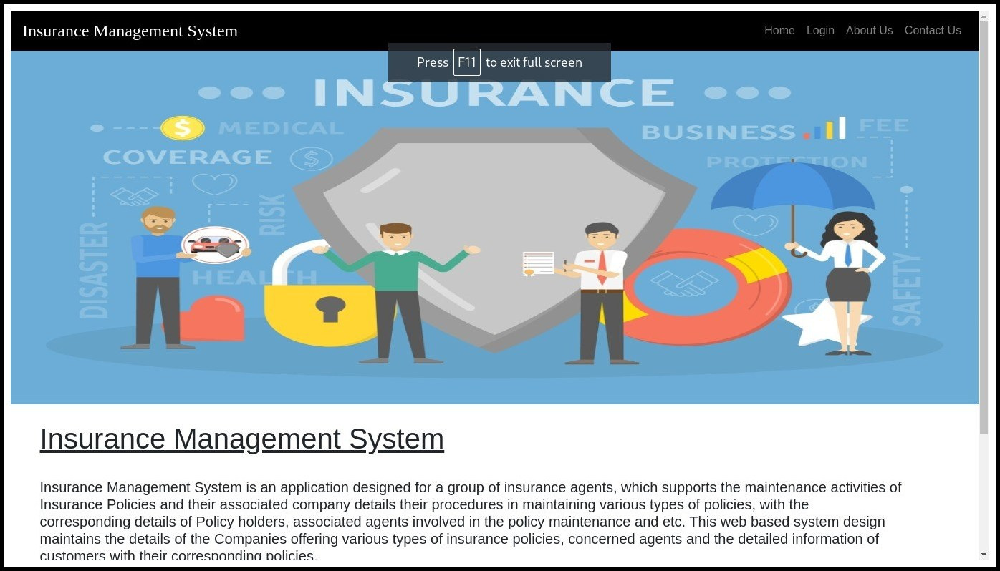
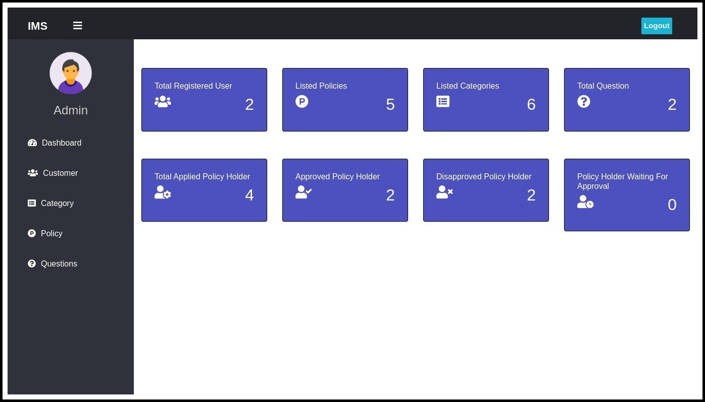
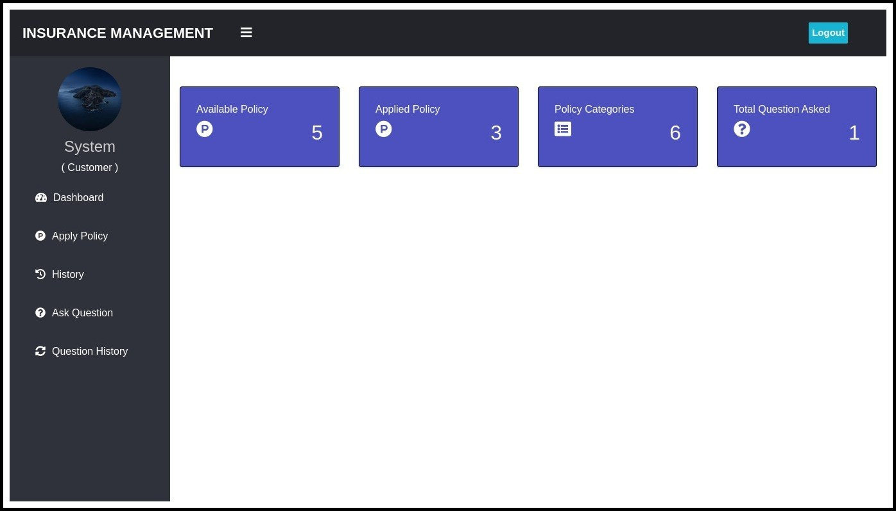
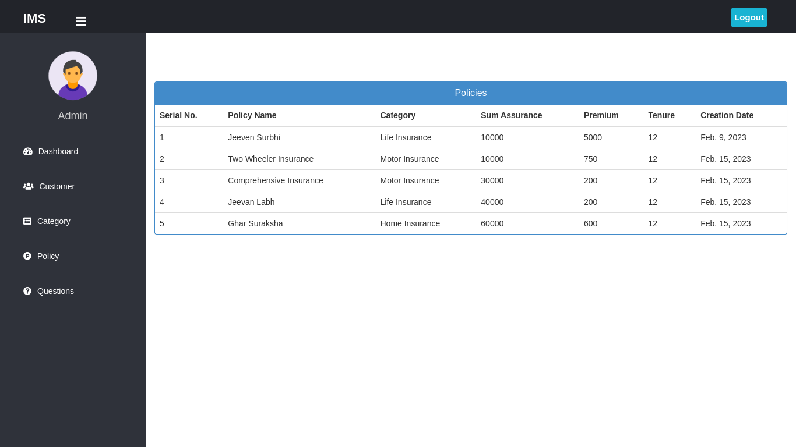
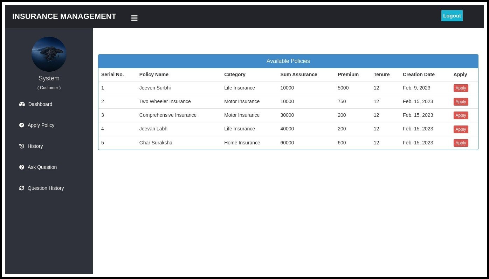

# Insurance Management System  

## Overview  
The **Insurance Management System** is an online micro-insurance analysis and information management system developed as a college project. It provides easy access to information regarding insurance services, policies, and resources. The system is dynamic, offering features like search tools for insurance awareness articles, guidelines, and illustrations through images for visitors.  

This project is built using the **Django MVC architecture** and aims to simplify insurance-related services for both customers and insurance provider companies.  

---

## Features  

### Admin Module  
The Admin module includes the following sections:  
1. **Login**  
2. **Registration**  
3. **Insurance Category**  
4. **Insurance Sub-category**  
5. **Insurance Policy**  
6. **User Details**  
7. **Policy Holders**  
8. **Tickets**  
9. **Insurance**  

### User Features  
- View and update profile.  
- Change password.  
- Search tools for insurance awareness articles.  
- Auto-suggestions for insurance policies.  
- Detailed comparison between insurance policies.  
- Recommendations for new insurance services.  

---

## Purpose  
This system is designed to improve and ease insurance-related services for both customers and insurance providers.  

- **Superuser (Admin):**  
    - Responsible for managing all users and system functionalities.  
    - Can manage insurance categories, policies, and user details.  

- **Customer:**  
    - Can buy insurance services or manage existing ones.  
    - Receives recommendations and detailed information about insurance services.  

---

## Dynamic Features  
- Search tools for insurance awareness articles.  
- Auto-suggestions for suitable insurance policies.  
- Detailed comparisons between insurance policies.  
- Notifications for new insurance services introduced in the market.  

---

## Technology Stack  
- **Backend:** Django (MVC Architecture)  
- **Frontend:** HTML, CSS, JavaScript  
- **Database:** SQLite  

---

## Screenshots  

### Home Page  
  

### Admin Dashboard  
  

### User Dashboard  
  

### Insurance Policy  [VIEW/APPLY]
  
  

---

## How to Run the Project  
1. Clone the repository:  
     ```bash  
     git clone https://github.com/amankrs21/insurance-management-system.git  
     ```  
2. Navigate to the project directory:  
     ```bash  
     cd insurance-management-system  
     ```  
3. Install dependencies:  
     ```bash  
     pip install -r requirements.txt  
     ```  
4. Run the server:  
     ```bash  
     python manage.py runserver  
     ```  
5. Open the browser and visit:  
     ```  
     http://127.0.0.1:8000/  
     ```  

---

## License  
This project is for educational purposes only.  
